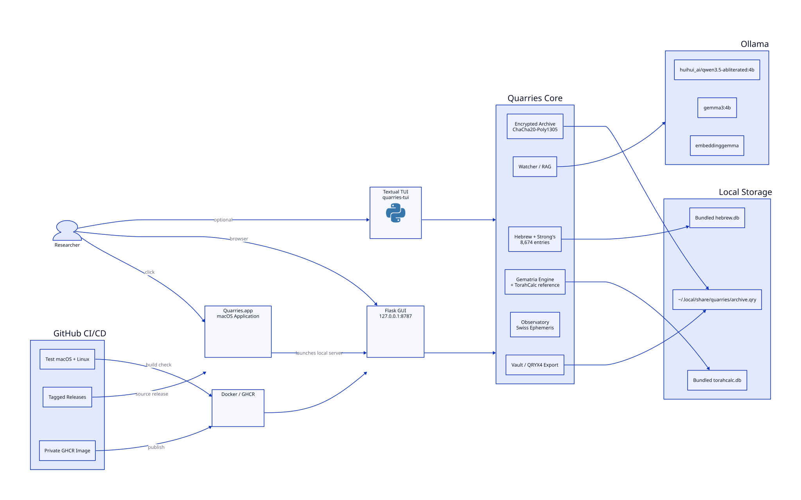

# Quarries v0.9.3

[](https://github.com/iamrichmack111/quarries/actions/workflows/ci.yml)
[](https://github.com/iamrichmack111/quarries/actions/workflows/docker.yml)
[](https://github.com/iamrichmack111/quarries/actions/workflows/release.yml)


<p align="center"></p>

**The Archive remembers. The Watcher listens. You decide what is revealed.**

Quarries is a private local research workspace combining an encrypted personal Archive, a Flask desktop/web GUI, an optional Textual terminal UI, local Ollama inference and semantic retrieval, a preserved Hebrew/Strong's lexical database, multi-method gematria, a TorahCalc-derived local reference, and a Swiss Ephemeris Observatory.

## Architecture



The editable D2 source is [`docs/architecture.d2`](docs/architecture.d2). See [`docs/ARCHITECTURE.md`](docs/ARCHITECTURE.md) for trust boundaries and rendering instructions.

The delivery pipeline is documented in [`docs/CI-CD.md`](docs/CI-CD.md), with editable D2 source at [`docs/cicd.d2`](docs/cicd.d2).

## v0.9.3 highlights

- **System Applications install:** the macOS desktop bundle now installs to `/Applications/Quarries.app` and refreshes LaunchServices.
- **Desktop launcher hardening:** CI validates that `CFBundleExecutable` exists, is executable, and targets the stable Quarries runtime.
- **Stable Flask entry point:** desktop/CLI launchers resolve to the packaged `quarries.webapp:main` entry point rather than a version-numbered Downloads folder.
- **Expanded CI/CD documentation:** added `docs/CI-CD.md` and editable `docs/cicd.d2` pipeline architecture with GitHub Actions, macOS/Linux tests, GHCR and release flow.
- **Expanded Wiki:** added dedicated Desktop App and CI/CD pages.
- **Container health checks:** Docker and Compose now expose runtime health through `/api/status`.
- Keeps all v0.9.2 features: detailed README, D2 system architecture, GitHub Actions, private GHCR delivery, release automation, Wiki bootstrap, Docker Compose, badges and repository topics.
- Maintains the masked Archive/Watcher password fields introduced in v0.9.1.

## Core workspaces

### The Archive

- Password-protected encrypted Leaves stored in the user's local SQLite database.
- ChaCha20-Poly1305 encrypted text fields.
- Search, edit, delete and local semantic indexing.
- Quarries Hebrew-letter substitution and RTL 3-4-5 rendering.
- `embeddinggemma` vector indexing with model/dimension/version metadata.
- Password-encrypted QRYX4 exports.

### The Watcher

- Independent Watcher password.
- Default model: `huihui_ai/qwen3.5-abliterated:4b`.
- Reference-context model: `gemma3:4b`.
- Similar-Leaf retrieval using local embeddings.
- Empty Mind, Reference, Similar Leaves, and Reference + Similar modes.
- AI interpretation is kept separate from deterministic calculators and reference data.

### Hebrew / Strong's

- Bundled read-only lexicon containing **8,674 entries**.
- Search by Hebrew, Strong's `H####`, transliteration, pronunciation, custom gloss, or definition.
- Preserves the source database's custom glosses, definitions and notes.
- Niqqud/cantillation-insensitive Hebrew matching.
- Mispar Gadol and saved study list with CSV export.

> The bundled Hebrew database contains lexical entries, not a complete Strong's-tagged verse/token corpus. Quarries does not claim to ship a full interlinear Tanakh.

### Gematria Dictionary

- Bundled TorahCalc-derived `torahcalc.db` reference.
- **1,381 structured numbered sections** and **1,380 distinct values** in the current indexed source.
- Exact number lookup and full-text concept search.
- Source PDF page provenance.
- Related-concept recommendations are explicitly separate from authoritative exact-number lookup.
- Multi-method calculator includes the supported systems implemented in `quarries/gematria.py`; spelling-dependent systems are labeled accordingly.
- Prime factorization and repeated digit reduction are arithmetic metadata, not additional gematria methods.

### Observatory

Swiss Ephemeris-backed local calculations include current/event and natal charts, Tropical and Sidereal modes, multiple sidereal references, several house systems, planetary/node positions, Ascendant/Descendant, MC/IC, cusps, retrograde state, sign element/modality/polarity, traditional essential dignity, aspects, Moon phase/illumination and sunrise/sunset.

The Observatory is deterministic and intentionally **not** sent to the Watcher for astrological interpretation.

## Security model

Quarries uses three independent gates:

1. **Application password** — enters Quarries.
2. **Archive password** — unlocks encrypted Leaves and Archive retrieval.
3. **Watcher password** — unlocks encrypted Watcher conversations.

Archive and Watcher remain locked until their own passwords are entered. Browser password inputs are masked. Active encryption keys are kept in process memory and are not stored in browser cookies. **Lock All** clears the active keys and ephemeral Reference Context.

The primary personal database remains:

```text
~/.local/share/quarries/archive.qry
```

It lives outside the application/runtime tree, so normal application upgrades do not replace it. Back it up before major upgrades:

```bash
cp ~/.local/share/quarries/archive.qry ~/.local/share/quarries/archive-backup-$(date +%Y%m%d-%H%M%S).qry
```

## macOS desktop installation

Requirements: macOS 11+, Python 3.10+, and Ollama for Watcher/RAG features.

```bash
chmod +x install.sh
./install.sh
```

The installer creates:

```text
~/Library/Application Support/Quarries/runtime/
/Applications/Quarries.app
/usr/local/bin/quarries       # when writable/available
/usr/local/bin/quarries-tui   # optional terminal UI
```

The app bundle contains the Quarries icon and launches the installed standalone runtime without opening a Terminal window. The Flask server still defaults to `127.0.0.1:8787` and opens the default browser.

Launch from Finder/Spotlight or:

```bash
open /Applications/Quarries.app
```

CLI equivalents:

```bash
quarries       # Flask GUI
quarries-tui   # original Textual TUI
```

## Ollama models

```bash
ollama pull huihui_ai/qwen3.5-abliterated:4b
ollama pull gemma3:4b
ollama pull embeddinggemma
```

## Docker

Build and run locally:

```bash
docker compose up --build
```

Open `http://127.0.0.1:8787`.

The host port is deliberately loopback-only. Personal data is persisted in the `quarries-data` named volume. The Compose configuration expects Ollama on the host at `11434` via `host.docker.internal`.

Direct build:

```bash
docker build -t quarries:local .
docker run --rm \
  -p 127.0.0.1:8787:8787 \
  -e QUARRIES_HOST=0.0.0.0 \
  -e QUARRIES_OPEN_BROWSER=0 \
  -v quarries-data:/home/quarries/.local/share/quarries \
  quarries:local
```

## Development

```bash
python3 -m venv .venv
source .venv/bin/activate
python -m pip install --upgrade pip
python -m pip install -e . pytest
pytest -q
quarries
```

Runtime variables:

| Variable | Default | Purpose |
|---|---|---|
| `QUARRIES_HOST` | `127.0.0.1` | Flask bind address |
| `QUARRIES_PORT` | `8787` | Flask port |
| `QUARRIES_OPEN_BROWSER` | `1` | Set `0` for Docker/headless |

## CI/CD

GitHub Actions workflows are under `.github/workflows/`:

- **CI:** Ubuntu + macOS tests across Python 3.10 and 3.12, import smoke test, and package artifact build.
- **Docker / GHCR:** builds and publishes `ghcr.io/iamrichmack111/quarries` on main/tag pushes. Repository/package privacy should remain private.
- **Release:** pushing a `v*` tag builds wheel/sdist/source ZIP and creates a GitHub Release.

## Wiki

Seed pages live under `wiki/`. Initialize or refresh the GitHub Wiki with:

```bash
./scripts/init_wiki.sh
```

This enables the Wiki, clones the `.wiki.git` repository, synchronizes the seeded pages, commits them, and pushes them.

## Repository metadata and topics

Apply the description/topics and ensure Wiki is enabled:

```bash
./github_metadata.sh
```

Current topics include `python`, `flask`, `textual`, `sqlite`, `encryption`, `privacy`, `local-ai`, `ollama`, `rag`, `embeddings`, `embeddinggemma`, `hebrew`, `strongs-concordance`, `gematria`, `mispar-gadol`, `swiss-ephemeris`, `astronomy`, `astrology`, `macos`, and `docker`.

## Release / push

```bash
git add .
git commit -m "Release Quarries v0.9.3 macOS app and delivery hardening"
git push origin main
git tag -a v0.9.3 -m "Quarries v0.9.3"
git push origin v0.9.2
```

Then initialize/refresh metadata and Wiki:

```bash
./github_metadata.sh
./scripts/init_wiki.sh
```

## Privacy notes

Never commit `archive.qry`, `.qryx` exports, passwords, secret keys, or private records. Review redistribution rights for bundled lexical/reference data before changing repository visibility. The repository is intended to remain **private**.

## Changelog

See [`CHANGELOG.md`](CHANGELOG.md).
