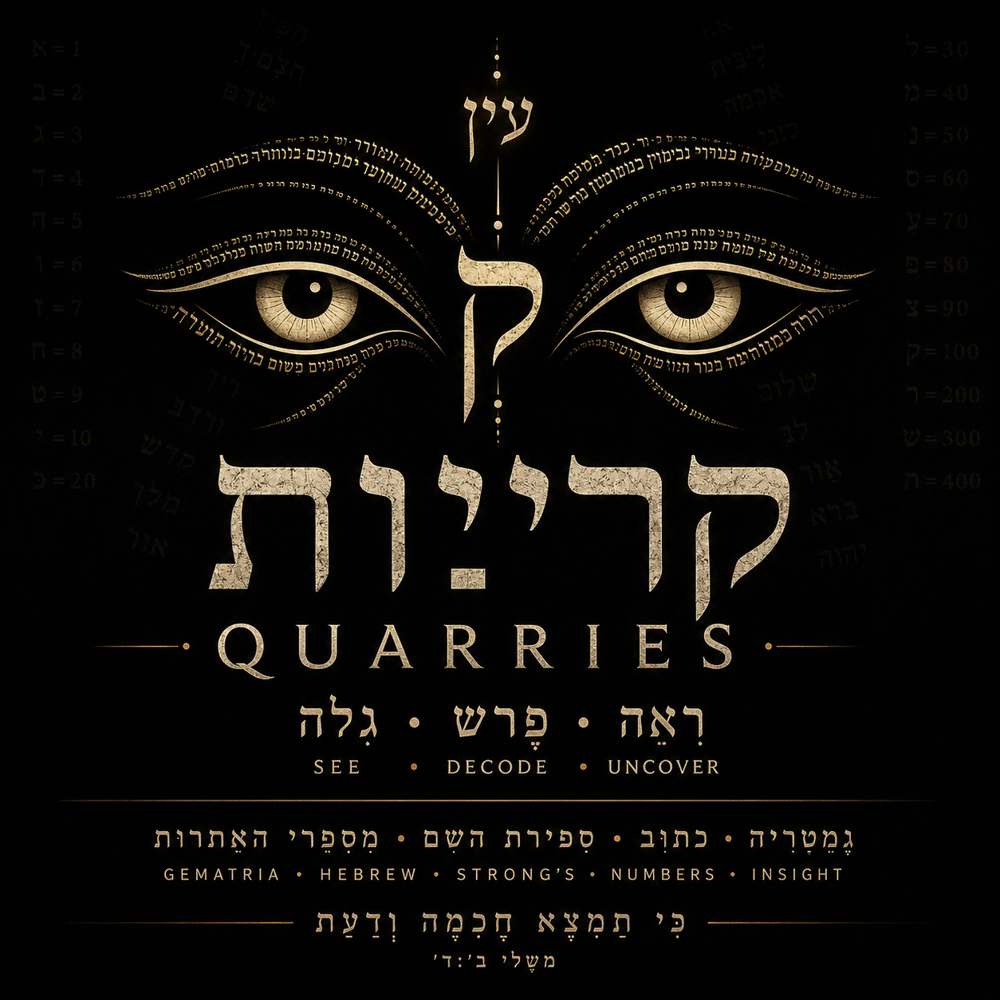

# Quarries v0.8.4



## v0.8.4 highlights

- Added a Hebrew-inspired terminal-safe eye logo to `man quarries`; the full graphical logo remains bundled at `assets/quarries-logo.png` and is used by the macOS app.
- **F6 is now context-aware:** on Hebrew / Strong's it copies the selected Hebrew lemma; on Gematria Dictionary it copies the current Hebrew calculation input or the selected value as Hebrew numerals; on Archive it retains the existing Hebrew-substitution copy behavior.
- Hebrew / Strong's now includes a visible **Copy Hebrew [F6]** action.
- The release includes a **Quarries.app** macOS launcher using the new Hebrew-focused Quarries logo. The TUI still runs in Terminal, but it can now be launched like a normal Mac application after installation.
- The installer installs the CLI, man page, and on macOS the application bundle.
- Upgrades preserve the personal database at `~/.local/share/quarries/archive.qry`; the release ZIP does **not** contain your personal Archive database.

**The Archive remembers. The Watcher listens. You decide what is revealed.**

Quarries is a private terminal research workspace that combines an encrypted personal Archive, local semantic retrieval, a local AI Watcher, a preserved Hebrew/Strong's lexical database with custom glosses, Mispar Gadol gematria, saved Hebrew study lists, and a local Swiss Ephemeris Observatory.

Quarries is designed to keep deterministic data and private writing local. The Observatory remains a calculation tool and is intentionally **not** sent to the Watcher.

## Highlights

### The Archive
- Password-protected encrypted Leaves stored in SQLite.
- ChaCha20-Poly1305 encrypted text fields.
- Searchable/editable personal notes.
- Quarries Hebrew-letter substitution and RTL 3-4-5 rendering.
- `F6` copies the Hebrew substitution.
- `F7` copies the RTL 3-4-5 view.
- Local semantic indexing with `embeddinggemma`.
- Model/dimension/index-version metadata prevents incompatible embedding spaces from being mixed.
- Re-index support for stale or previous-model embeddings.
- Password-encrypted `.qryx` Archive exports.

### The Watcher
- Separately password-protected local conversation workspace.
- Default chat model: `huihui_ai/qwen3.5-abliterated:4b`.
- Reference-context model: `gemma3:4b`.
- Local Ollama inference; no hosted LLM is required.
- Similar-Leaf retrieval from the encrypted Archive.
- Visible Reference Context for intentionally shared material.
- `F8` copies the most recent Watcher response.

### Hebrew / Strong's
- Bundled local Hebrew Fuzzy lexicon with **8,674 entries**.
- Search by Hebrew, Strong's `H####`, transliteration, pronunciation, gloss, or definition.
- Niqqud/cantillation-insensitive Hebrew matching.
- Preserved custom `gloss`, `definitions`, and `notes`.
- Mispar Gadol shown with dictionary entries.
- Live Mispar Gadol calculator: paste or type Hebrew and it calculates immediately.
- Final-letter values: `ך=500`, `ם=600`, `ן=700`, `ף=800`, `ץ=900`.
- Persistent saved-word study list.
- CSV export with Hebrew, Strong's ID, transliteration, morphology, custom gloss, definitions, notes, Mispar Gadol, and save time.
- Hebrew lexical entries can be intentionally sent to Watcher as Reference Context.

> The bundled Hebrew database currently contains lexical entries but no complete Strong's-tagged verse corpus. Quarries does not claim to include a complete interlinear Tanakh.

### Observatory
The Observatory uses Swiss Ephemeris locally and remains independent of the Watcher.

It calculates current/event and natal/birth charts, Tropical and Sidereal zodiac modes, multiple sidereal references, multiple house systems, planetary and node positions, Ascendant/Descendant, MC/IC, house cusps, retrograde motion, sign element/modality/polarity, traditional essential dignity, major/selected minor aspects, Moon phase/illumination, and sunrise/sunset for supplied coordinates/timezone.

Location is entered as latitude, longitude, and an IANA timezone such as `America/New_York`. Coordinates are the geographic location; the timezone identifier is only the local clock rule.

## Security model

Quarries uses three independent gates:

1. **Application password** — enters the Quarries shell.
2. **Archive password** — unlocks encrypted Leaves and Archive retrieval.
3. **Watcher password** — unlocks encrypted Watcher conversations.

The Archive and Watcher do not automatically unlock when the application gate opens.

`Ctrl+L` or the visible **Lock All** button clears the active application, Archive, Watcher, and ephemeral Reference Context keys from memory and returns to the application gate.

Auto-lock defaults to 10 minutes and can be configured for 1, 5, 10, 15, 30, or 60 minutes.

## Local data

The primary Quarries SQLite database is stored under:

```text
~/.local/share/quarries/archive.qry
```

This file lives outside the application/release directory. Installing a new Quarries release or sharing the release ZIP does not copy, reset, or delete your personal database. A recipient starts with their own new local database on first run.

Back up the Archive before major upgrades:

```bash
cp ~/.local/share/quarries/archive.qry ~/.local/share/quarries/archive-backup-$(date +%Y%m%d-%H%M%S).qry
```

## Requirements

- macOS or Linux
- Python 3.10+
- Ollama for Watcher/RAG features

Install the local models:

```bash
ollama pull huihui_ai/qwen3.5-abliterated:4b
ollama pull gemma3:4b
ollama pull embeddinggemma
```

## Install

```bash
chmod +x install.sh
./install.sh
```

The installer creates an isolated virtual environment, installs Quarries, places a global launcher in `/usr/local/bin` when possible, installs the `quarries(1)` man page, and falls back to `~/.local/bin` if system installation is unavailable. On macOS it also installs `Quarries.app` into `/Applications` when possible (or `~/Applications` as a fallback). The app opens the Quarries TUI in Terminal and uses the bundled Quarries logo as its application icon.

Launch from any directory:

```bash
quarries
```

On macOS you can also launch **Quarries** from Finder, Spotlight, or Launchpad after running `install.sh`.

Read the manual:

```bash
man quarries
```

### Why `/usr/local/bin` instead of `/bin`?

On modern macOS, `/bin` is protected by System Integrity Protection and is reserved for operating-system commands. `/usr/local/bin` is the standard location for user-installed command-line programs.

## Keyboard shortcuts

| Key | Action |
|---|---|
| `Ctrl+L` | Lock all modules |
| `Ctrl+N` | New Leaf |
| `Ctrl+S` | Preserve Leaf |
| `F6` | Copy Hebrew for the active workspace (Strong's lemma / Gematria input or numeral / Archive substitution) |
| `F7` | Copy RTL 3-4-5 |
| `F8` | Copy latest Watcher response |
| `Ctrl+Q` | Quit |

## Mispar Gadol example

```text
שלום
ש(300) + ל(30) + ו(6) + ם(600) = 936
```

Niqqud and cantillation are ignored.

## Privacy

Do not commit your personal `archive.qry`, `.qryx` exports, passwords, or private records. Review redistribution rights for any bundled lexical/reference data before making the repository public.

## Current limitations

- The packaged Hebrew lexicon does not yet include a complete Strong's-tagged Tanakh verse/token corpus.
- Observatory calculations are local; Quarries intentionally does not generate LLM astrology interpretations.
- Ollama must be running for Watcher and embedding features.

## Repository metadata

Suggested GitHub description:

> Private encrypted research workspace with local AI, Hebrew/Strong's study, Mispar Gadol, semantic RAG, and Swiss Ephemeris charts.

Suggested topics:

`python`, `textual`, `sqlite`, `encryption`, `privacy`, `local-ai`, `ollama`, `rag`, `embeddings`, `embeddinggemma`, `hebrew`, `strongs-concordance`, `gematria`, `mispar-gadol`, `swiss-ephemeris`, `astronomy`, `astrology`, `terminal-ui`, `research-tools`, `knowledge-management`

See `GITHUB.md` for commands.


## Gematria Dictionary (v0.8.0)

Quarries now bundles a structured local reference derived from the user-supplied 268-page gematria PDF.

- **1,381 structured numbered sections**
- **1,380 distinct gematria values**
- Direct exact-number lookup: typing `73` immediately retrieves every source section indexed under 73.
- Full-text concept search across the dictionary definitions.
- Source PDF page provenance on every result.
- Local related-concept recommendations based on text similarity.
- A Methods view covering the gematria systems described in the opening source charts.
- Exact numeric lookup is kept separate from recommendations so a similarity result can never replace the source's value assignment.

The reference is stored read-only as `quarries/data/torahcalc.db`. The original PDF is not required at runtime.


## Number structure + multi-method gematria (v0.8.1)

The Gematria Dictionary now explains the arithmetic metadata printed by the source. For example, `408 → 12 → 3` is repeated decimal digit reduction, while `408 = 2^3 × 3 × 17` is prime factorization: the unique prime-number building blocks of 408. Factorization is displayed as mathematical structure, not treated as another gematria system.

The Dictionary tab also has a Hebrew multi-method calculator with live results and CSV export. Supported calculations include Mispar Hechrachi, Gadol, Siduri, Katan, Perati, Shemi, Musafi, Bone'eh, Kidmi, Ne'elam, Meshulash, Ha'achor, Katan Mispari, Kolel, AtBash, Albam, Ofanim, Avgad, and Reverse Avgad. Shemi and Ne'elam use the explicit letter-name spellings from the source chart and are labeled as spelling-dependent.
